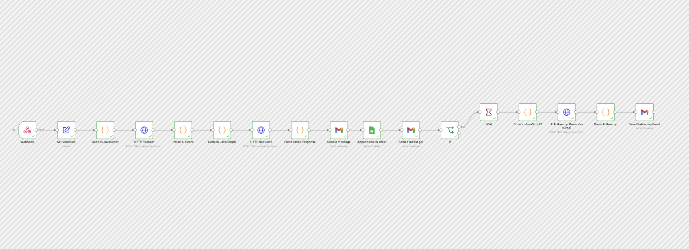
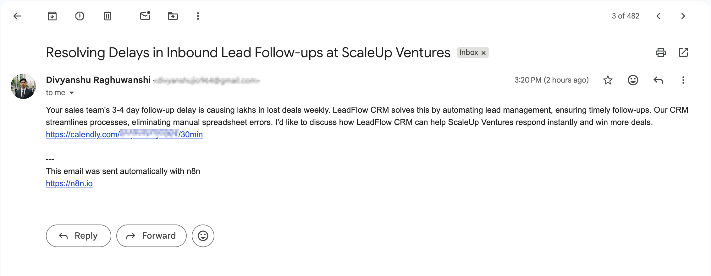
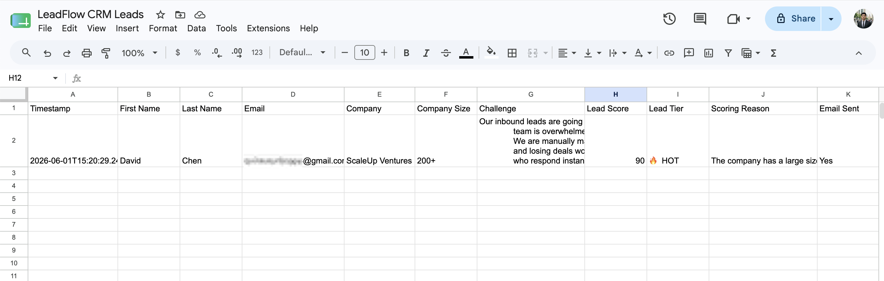

# ⚡ Speed-to-Lead Automation System

> AI-personalized lead response in under 60 seconds — built with n8n + Groq + Gmail + Google Sheets

🔴 **Live Demo:** [leadflowcrm.carrd.co](https://leadflowcrm.carrd.co)

---

## What This Does

The moment a lead submits a demo request form:

1. **AI scores the lead** (HOT / WARM / COLD) based on company size and challenge urgency
2. **AI writes a personalized email** referencing their exact challenge
3. **Email is sent automatically** within 60 seconds — no human involved
4. **Lead is logged** in Google Sheets with score, tier, and scoring reason
5. **Sales rep is notified** instantly with full lead details
6. **HOT leads get a follow-up** AI-written email after 24 hours automatically

---

## Results

| Metric | Value |
|--------|-------|
| Response time | Under 60 seconds |
| Lead scoring | AI-powered (0-100 score) |
| Personalization | Based on company + challenge |
| Follow-up | Automated for HOT leads |
| Human involvement | Zero |

Tally Form → n8n Webhook → AI Lead Scorer (Groq) →
AI Email Generator (Groq) → Gmail → Google Sheets →
Sales Notification → HOT Lead Follow-up Sequence
---

## Tech Stack

| Tool | Purpose | Cost |
|------|---------|------|
| n8n | Workflow automation | Self-hosted free |
| Groq (Llama 3.3 70B) | AI email generation + lead scoring | Free |
| Gmail API | Send emails | Free |
| Google Sheets | CRM logging | Free |
| Tally.so | Lead capture form | Free |
| GCP e2-micro | Server hosting | Free forever |

---

## Screenshots

### n8n Workflow Canvas

### AI Email Received

### Google Sheets CRM Log

---

## How to Deploy This Yourself

See [setup_guide.md](docs/setup_guide.md) for full deployment instructions.

---

## Use Cases

This system can be adapted for:
- **Real estate agencies** — instant property inquiry response
- **SaaS companies** — demo request follow-up
- **Recruitment firms** — candidate inquiry handling
- **E-commerce** — abandoned cart recovery
- **Coaching businesses** — discovery call booking

---

## About

Built by **Divyanshu** — AI Automation Engineer & Data Analyst

- 🔗 [Upwork Profile](https://www.upwork.com/freelancers/~01201869f94c5013ea?mp_source=share)
- 💼 [LinkedIn](https://www.linkedin.com/in/divyanshu964/)
- 📧 divyanshuraghuwanshi964@gmail.com

---

## System Architecture
